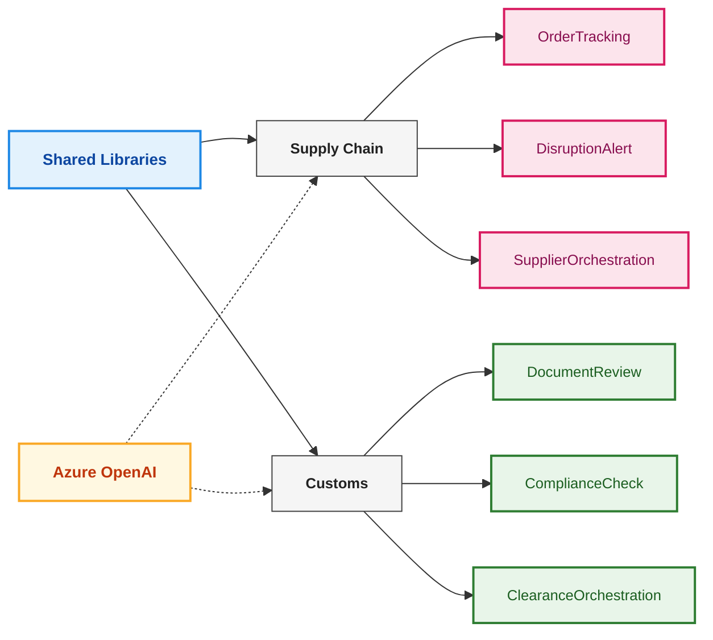
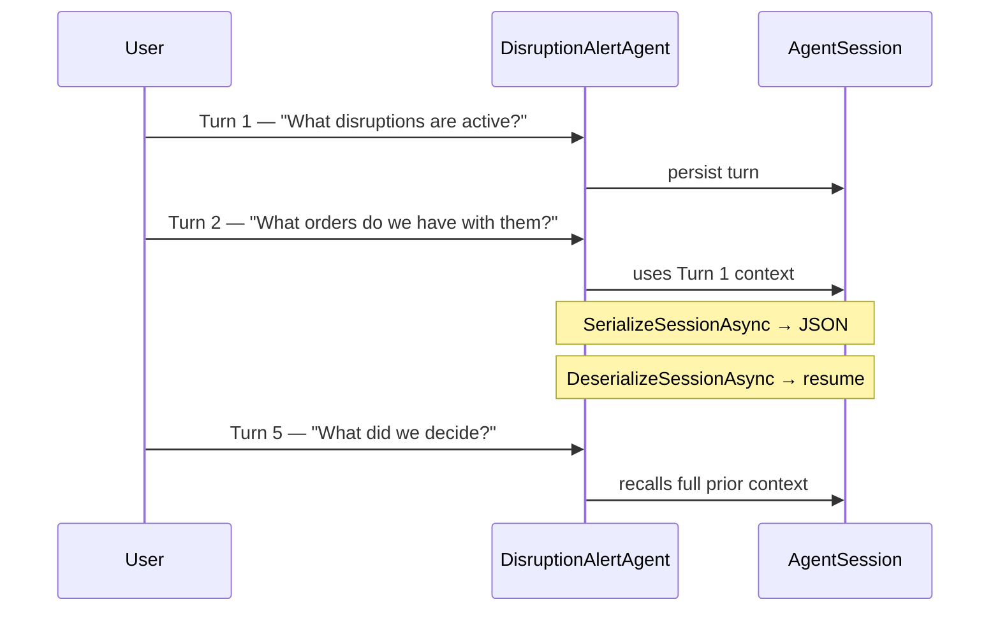
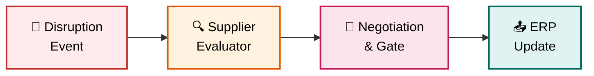
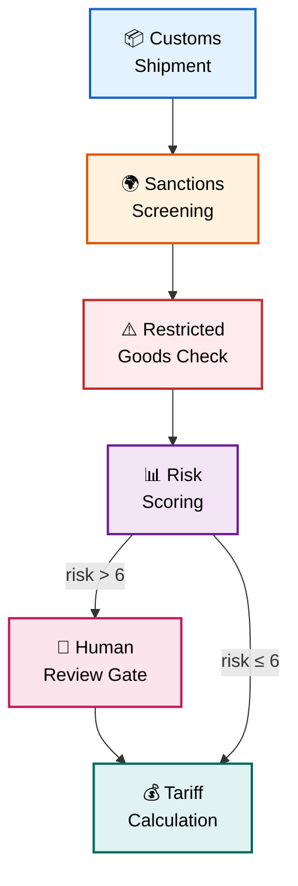

# Microsoft Agent Framework — Supply Chain & Customs Samples

A knowledge sharing collection for building Agents using **Microsoft Agent Framework** (`Microsoft.Agents.AI` v1.1.0) in **.NET 10 / C# 13**, showcasing the full spectrum from single-agent tool use to complex multi-agent orchestration workflows across two real-world domains: **Supply Chain** and **Customs Clearance**.

---

## RAG (01) — Retrieval-Augmented Generation

**RAG updates introduced in this repository**

| Sample | Project | Concept | Key Feature |
| ------- | ------- | --------- | ------------ |
| 01 | `01-customs-rag-embeddings` | 🧭 Embedding-Based RAG | Semantic vector retrieval using in-memory vector store |
| 02 | `02-customs-rag-sqlserver-2025` | 🗄️ SQL Vector RAG | Semantic vector retrieval using SQL Server 2025 |

### What Changed

- Added an **embedding-based customs RAG** sample using Azure OpenAI embeddings and in-memory vector search.
- Added a **SQL Server 2025 RAG** sample that stores embeddings in a SQL `vector` column and retrieves matches with `VECTOR_DISTANCE(...)`.
- Added support for configurable embedding settings via `AzureOpenAI:EmbeddingEndpoint`, `AzureOpenAI:EmbeddingDeploymentName`, and `AzureOpenAI:EmbeddingApiKey`.

### RAG-Specific Packages

| Package | Version | Used for |
| ------- | ------- | ---------- |
| `Microsoft.Extensions.AI.OpenAI` | 10.4.0 | OpenAI/Azure OpenAI extension helpers used by RAG samples |
| `Microsoft.Extensions.VectorData.Abstractions` | 10.1.0 | Vector data contracts used in embedding-based RAG |
| `Microsoft.SemanticKernel.Connectors.InMemory` | 1.74.0-preview | In-memory vector store for semantic retrieval |
| `Microsoft.Data.SqlClient` | 6.1.1 | SQL Server 2025 vector storage and retrieval |

### Sample 01: Customs RAG with Embeddings (🧭 Semantic Vector Retrieval)

**Pattern:** Embedding-based Retrieval-Augmented Generation using semantic vector search

| Detail | Value |
| ------- | ------- |
| Project | `01-customs-rag-embeddings` |
| Agent | `CustomsEmbeddingRagAgent` |
| Key API | `GetEmbeddingClient(...).AsIEmbeddingGenerator()`, `InMemoryVectorStore`, `VectorSearchAsync(...)` |
| Behavior | Retrieves semantically similar customs snippets using embeddings before answering |

This sample demonstrates semantic RAG with vector retrieval. It builds embeddings for customs knowledge records, stores them in an in-memory vector index, and retrieves top semantic matches for grounded responses.

**Solution approach:** This version extends the same customs domain with semantic retrieval. It generates embeddings for each knowledge record, stores them in an in-memory vector store, and performs similarity search so retrieval works even when the user wording does not exactly match the stored text.

The flow is: build embeddings -> upsert records into the vector index -> run vector search for the user query -> pass the matched snippets into the agent for grounded answering. This sample shows the shape of a semantic RAG pipeline while still keeping the infrastructure local and inspectable.

```csharp
var embeddingGenerator = embeddingClient
    .GetEmbeddingClient(embeddingDeployment)
    .AsIEmbeddingGenerator();

var vectorStore = new InMemoryVectorStore(new InMemoryVectorStoreOptions
{
    EmbeddingGenerator = embeddingGenerator
});

var collection = vectorStore.GetCollection<Guid, CustomsVectorStoreRecord>("customs-knowledge");
```

### Sample 02: Customs RAG with SQL Server 2025 (🗄️ SQL Vector Retrieval)

**Pattern:** Embedding-based Retrieval-Augmented Generation using SQL Server 2025 vector storage

| Detail | Value |
| ------- | ------- |
| Project | `02-customs-rag-sqlserver-2025` |
| Agent | `CustomsSqlServerRagAgent` |
| Key API | `CAST(@embedding AS vector(1536))`, `VECTOR_DISTANCE('cosine', ...)`, `Microsoft.Data.SqlClient` |
| Behavior | Persists embeddings in SQL Server 2025 and retrieves nearest customs snippets before answering |

This sample demonstrates semantic RAG with a database-backed vector store. It keeps the same customs domain and agent workflow as the in-memory embedding sample, but stores embeddings in SQL Server 2025 and queries them with vector distance functions.

**Solution approach:** The sample creates a database and table if needed, embeds each customs knowledge entry, writes the embeddings into a SQL `vector(1536)` column, and uses cosine distance ordering to fetch the most relevant rows for the user question. The retrieval path is also exposed as an agent tool so the model can fetch grounding context on demand.

```csharp
SELECT TOP (@topK)
    Reference,
    Title,
    Content,
    Region,
    RiskLevel
FROM dbo.CustomsKnowledge
ORDER BY VECTOR_DISTANCE('cosine', Embedding, CAST(@embedding AS vector(1536)));
```

---

## Architecture Overview

If you are viewing this in VS Code and the diagram is blank or not rendered, install the `Markdown Preview Mermaid Support` extension (`bierner.markdown-mermaid`) and use `Markdown: Open Preview to the Side`.



---

## Samples

**Quick Reference — Which Concept Does Each Sample Demonstrate?**

| Sample | Project | Concept | Key Feature |
| ------- | ------- | --------- | ------------ |
| 1 | `SupplyChain.OrderTracking` | 🔧 Single Agent + Tools | Streaming API calls |
| 2 | `SupplyChain.DisruptionAlert` | 💾 Multi-Turn Session Memory | Context persistence across turns |
| 3 | `SupplyChain.SupplierOrchestration` | 🔀 Multi-Agent Workflow | Executor orchestration + human gate |
| 4 | `Customs.DocumentReview` | 🌍 Single Agent + Domain Tools | Structured review workflow |
| 5 | `Customs.ComplianceCheck` | 🛢️ Conditional Routing + Human Gate | Dynamic routing based on risk score |
| 6 | `Customs.ClearanceOrchestration` | 📦 End-to-End Pipeline | 6-stage pipeline with tracing |


## Solution Structure

```text
learning_agent_framework/
├── SupplyChainCustoms.AgentFramework.slnx
│
├── shared/
│   ├── SharedModels/
│   │   └── SharedModels/
│   │       ├── SupplyChain/
│   │       │   ├── Shipment.cs       — Shipment, ShipmentEvent, ShipmentStatus
│   │       │   ├── Supplier.cs       — Supplier, SupplierDisruption, DisruptionSeverity
│   │       │   └── Order.cs          — Order, OrderLine, OrderStatus
│   │       └── Customs/
│   │           ├── Shipment.cs       — CustomsShipment, CustomsLine
│   │           ├── TradeDocument.cs  — TradeDocument, DocumentField, DocumentType
│   │           └── ComplianceResult.cs — ComplianceResult, FlagSeverity
│   │
│   └── MockDataServices/
│       └── MockDataServices/
│           ├── SupplyChain/
│           │   ├── MockShipmentService.cs  — TRK-001…005 (1 delayed, 1 in-transit)
│           │   ├── MockSupplierService.cs  — SUP-001…005 (SUP-002 disrupted: factory fire)
│           │   └── MockOrderService.cs     — 4 open orders
│           └── Customs/
│               ├── MockCustomsShipmentService.cs  — CSH-3001…3004 (3004: sanctioned)
│               ├── MockDocumentService.cs          — docs with intentional missing fields
│               └── MockTariffService.cs            — HS codes, duty rates, sanctioned countries
│
└── samples/
    ├── 02-supply-chain/
    │   ├── SupplyChain.OrderTracking/
    │   ├── SupplyChain.DisruptionAlert/
    │   └── SupplyChain.SupplierOrchestration/
    │       ├── Program.cs    — workflow wiring
    │       └── Executors.cs  — 3 executor classes
    │
    └── 03-customs/
        ├── Customs.DocumentReview/
        ├── Customs.ComplianceCheck/
        │   ├── Program.cs    — workflow + conditional edges
        │   └── Executors.cs  — 5 executor classes
        └── Customs.ClearanceOrchestration/
            ├── Program.cs    — 6-stage linear pipeline
            └── Executors.cs  — 6 executor classes + ClearanceContext
```

---

### Sample 1: Order Tracking (🔧 Single Agent + Tools)

**Pattern:** Single agent with domain tools, streaming output

| Detail | Value |
| ------- | ------- |
| Project | `SupplyChain.OrderTracking` |
| Agent | `OrderTrackingAgent` |
| Key API | `agent.RunStreamingAsync(query)` |
| Tools | `GetShipmentStatus`, `GetDelayedShipments`, `GetOrdersBySupplier`, `FlagDelayedShipment` |

The agent answers supply chain queries by calling registered tools backed by `MockShipmentService` and `MockOrderService`. Responses stream token-by-token via `IAsyncEnumerable<AgentResponseUpdate>`.

```csharp
var agent = azureOpenAI.GetChatClient(deployment)
    .AsAIAgent(instructions: "...", name: "OrderTrackingAgent",
        tools: [AIFunctionFactory.Create(GetShipmentStatus), ...]);

await foreach (var update in agent.RunStreamingAsync(query))
    Console.Write(update.Text);
```

---

### Sample 2: Disruption Alert (💾 Multi-Turn Session Memory)

**Pattern:** Multi-turn conversation with session persistence and serialization

| Detail | Value |
| ------- | ------- |
| Project | `SupplyChain.DisruptionAlert` |
| Agent | `DisruptionAlertAgent` |
| Key API | `CreateSessionAsync`, `SerializeSessionAsync`, `DeserializeSessionAsync` |
| Tools | `GetActiveDisruptions`, `GetSupplierProfile`, `FindAlternativeSuppliers`, `GetAffectedOrders`, `GetInTransitShipments` |

Demonstrates **cross-turn memory**: the agent recalls which supplier was discussed in Turn 1 when answering Turn 3. Includes a session serialization round-trip that simulates saving to a database and resuming mid-conversation.



---

### Sample 3: Supplier Orchestration (🔀 Multi-Agent Workflow)

**Pattern:** Multi-agent workflow — three specialised executors with human approval gate

| Detail | Value |
| ------- | ------- |
| Project | `SupplyChain.SupplierOrchestration` |
| Trigger | `DisruptionEvent` (SUP-002 factory fire, $1,700 at risk, 5-day deadline) |
| Executors | `SupplierEvaluatorExecutor` → `NegotiationExecutor` → `ErpUpdateExecutor` |
| Human gate | Console prompt in `NegotiationExecutor` — approve/reject contract switch |
| Output | `YieldOutputAsync` → `run.OutgoingEvents.OfType<WorkflowOutputEvent>()` |



---

### Sample 4: Document Review (🌍 Single Agent + Domain Tools)

**Pattern:** Single agent with document-domain tools, GO/NO-GO recommendations

| Detail | Value |
| ------- | ------- |
| Project | `Customs.DocumentReview` |
| Agent | `DocumentReviewAgent` |
| Key API | `agent.RunStreamingAsync(query)` |
| Tools | `ListDocumentsForShipment`, `ReviewDocumentFields`, `ValidateHsCode`, `CheckDocumentCompleteness`, `GetShipmentDetails` |

The agent performs a structured 5-step review: document presence → field completeness → HS code validation → cross-document discrepancies → GO/NO-GO recommendation. Uses mock shipments CSH-3001 (complete) and CSH-3002 (gyroscopes, dual-use concern).

---

### Sample 5: Compliance Check (🛢️ Conditional Routing + Human Gate)

**Pattern:** Workflow with conditional edge routing and human officer review gate

| Detail | Value |
| ------- | ------- |
| Project | `Customs.ComplianceCheck` |
| Executors | `SanctionsScreeningExecutor` → `RestrictedGoodsExecutor` → `RiskScoringExecutor` → *(conditional)* → `TariffCalculationExecutor` |
| Routing | `risk > 6` routes through `HumanReviewExecutor`; `risk ≤ 6` skips directly to tariff calc |
| Test data | CSH-3001 (low risk, auto-cleared), CSH-3002 (medium), CSH-3004 (sanctioned, high risk) |



```csharp
// Conditional edge — explicit type parameter required for inference
.AddEdge<ComplianceContext>(bRiskScoring, bHumanReview,
    condition: msg => msg != null && msg.RequiresHumanReview)
.AddEdge<ComplianceContext>(bRiskScoring, bTariffCalc,
    condition: msg => msg != null && !msg.RequiresHumanReview)
```

---

### Sample 6: Clearance Orchestration (📦 End-to-End Pipeline)

**Pattern:** Six-executor end-to-end pipeline with timestamp tracing, shared `ClearanceContext`

| Detail | Value |
| ------- | ------- |
| Project | `Customs.ClearanceOrchestration` |
| Data flow | `CustomsShipment` → `ClearanceContext` → ... → final certificate |
| Executors | 6 in sequence (see diagram below) |
| Tracing | `Trace.Step(step, shipmentId)` prints `[HH:mm:ss.fff]` timestamps |
| Output | `StatusExecutor` emits formal clearance certificate via `YieldOutputAsync` |

```mermaid
graph LR
    IN["📦 Shipment<br/>Pending"]
    E1["📋 Document<br/>Collection"]
    E2["🏷️ HS Code<br/>Classification"]
    E3["🛡️ Compliance<br/>Screening"]
    E4["💰 Duty<br/>Calculation"]
    E5["📝 Filing<br/>Submission"]
    E6["✅ Final<br/>Status"]
    OUT["📜 Clearance<br/>Certificate"]

    IN --> E1 --> E2 --> E3 --> E4 --> E5 --> E6 --> OUT

    style IN fill:#4a90e2,stroke:#003d99,stroke-width:3px,color:#fff
    style E1 fill:#7b68ee,stroke:#4c2a85,stroke-width:2px,color:#fff
    style E2 fill:#f39c12,stroke:#c87f0a,stroke-width:2px,color:#fff
    style E3 fill:#e74c3c,stroke:#a93226,stroke-width:2px,color:#fff
    style E4 fill:#1abc9c,stroke:#117a65,stroke-width:2px,color:#fff
    style E5 fill:#27ae60,stroke:#1a5f39,stroke-width:2px,color:#fff
    style E6 fill:#9b59b6,stroke:#6c3483,stroke-width:2px,color:#fff
    style OUT fill:#2ecc71,stroke:#1e8449,stroke-width:3px,color:#fff
```



The `ClearanceContext` record accumulates state across all six executors:

```csharp
record ClearanceContext(
    CustomsShipment Shipment,
    bool DocumentsComplete, List<string>? MissingDocs,
    bool ClassificationPassed, List<string>? ClassificationIssues,
    bool CompliancePassed, int RiskScore, List<string>? ComplianceFlags,
    decimal TotalDuty, decimal TotalVat, List<string>? DutyBreakdown,
    bool Filed, string? DeclarationRef
);
```

---

## Key Framework Patterns

### Creating an Agent

```csharp
// From any ChatClient (Azure OpenAI, OpenAI, etc.)
var agent = new AzureOpenAIClient(new Uri(endpoint), new ApiKeyCredential(apiKey))
    .GetChatClient(deploymentName)
    .AsAIAgent(
        instructions: "You are a ...",
        name: "MyAgent",
        tools: [AIFunctionFactory.Create(MyTool)]
    );
```

### Tool Registration

```csharp
[Description("Retrieves the current status for a shipment.")]
ShipmentStatus GetStatus(
    [Description("The tracking number, e.g. TRK-001")] string trackingNumber)
{ ... }

// Register with the agent
AIFunctionFactory.Create(GetStatus)
```

### Streaming vs. Non-Streaming

```csharp
// Streaming — for user-facing output
await foreach (var update in agent.RunStreamingAsync(prompt, session))
    Console.Write(update.Text);

// Non-streaming — inside executor handlers
var response = await agent.RunAsync(prompt);
Console.WriteLine(response.Text);  // use .Text, not .ToString()
```

### Multi-Turn Sessions

```csharp
AgentSession session = await agent.CreateSessionAsync();

// Each turn automatically uses prior context
await foreach (var update in agent.RunStreamingAsync(turn1, session)) ...
await foreach (var update in agent.RunStreamingAsync(turn2, session)) ...

// Persist and restore
var json    = await agent.SerializeSessionAsync(session);
var resumed = await agent.DeserializeSessionAsync(json);
```

### Executor + Workflow Pattern

```csharp
// 1. Define executor (partial class required for source generator)
internal sealed partial class MyExecutor(AIAgent agent) : Executor("MyStep")
{
    [MessageHandler]
    private async ValueTask<OutputType> HandleAsync(InputType input, IWorkflowContext wf)
    {
        var response = await agent.RunAsync(prompt);
        await wf.YieldOutputAsync("result summary", CancellationToken.None);
        return new OutputType(...);
    }
}

// 2. Bind and wire
var bStep1 = step1.BindExecutor();   // → ExecutorBinding
var bStep2 = step2.BindExecutor();

var workflow = new WorkflowBuilder("MyWorkflow")
    .BindExecutor(bStep1)            // → WorkflowBuilder (fluent)
    .BindExecutor(bStep2)
    .AddEdge(bStep1, bStep2)
    .Build();

// 3. Run
var run = await InProcessExecution.Default.RunAsync(workflow, input);
foreach (var evt in run.OutgoingEvents.OfType<WorkflowOutputEvent>())
    Console.WriteLine(evt.Data);
```

### Conditional Edges

```csharp
// Explicit type parameter required — C# cannot infer T from pattern-matching lambdas
.AddEdge<MyContext>(bSource, bHighRiskTarget,
    condition: msg => msg != null && msg.RiskScore > 6)
.AddEdge<MyContext>(bSource, bLowRiskTarget,
    condition: msg => msg != null && msg.RiskScore <= 6)
```

---

## Known Patterns & Troubleshooting

### ChatResponseFormat Disambiguation

When a project imports both `OpenAI.Chat` and `Microsoft.Extensions.AI`, the `ChatResponseFormat` type becomes ambiguous. **Always use the fully qualified type** to avoid compilation errors:

```csharp
// ❌ Ambiguous — will not compile
var response = await agent.RunAsync<MyOutputType>(prompt, 
    new ChatClientAgentOptions 
    { 
        ResponseFormat = ChatResponseFormat.ForJsonSchema<MyOutputType>()
    });

// ✅ Correct — use full namespace
var response = await agent.RunAsync<MyOutputType>(prompt,
    new ChatClientAgentOptions
    {
        ResponseFormat = Microsoft.Extensions.AI.ChatResponseFormat.ForJsonSchema<MyOutputType>()
    });
```

### Reasoning Effort Configuration

In `Microsoft.Agents.AI.OpenAI v1.1.0`, custom `ChatOptions` for reasoning effort must be passed via the `AsAIAgent(ChatClientAgentOptions)` overload. Named parameters like `options: ChatOptions(...)` are **not available**:

```csharp
// ❌ Will fail — no 'options:' parameter exists
var agent = chatClient.AsAIAgent(
    instructions: "...",
    options: new ChatOptions { ... }
);

// ✅ Correct — use ChatClientAgentOptions
var agent = chatClient.AsAIAgent(
    instructions: "...",
    new ChatClientAgentOptions
    {
        ResponseFormat = Microsoft.Extensions.AI.ChatResponseFormat.ForJsonSchema<T>(),
        // other options here
    }
);
```

### Composing Multiple Tool Sets

When registering tools from multiple sources (e.g., reflected methods from different classes), **create each tool sequence independently and concatenate**, rather than chaining `Select()` over existing `AIFunction` objects:

```csharp
// ❌ Will fail — type inference and delegate mismatch
var tools = toolSet1
    .Concat(AIFunctionFactory.Create(tool2Method))
    .Select(t => t);

// ✅ Correct — create each sequence separately
var toolsFromClass1 = new[] { AIFunctionFactory.Create(method1), ... };
var toolsFromClass2 = new[] { AIFunctionFactory.Create(method2), ... };
var allTools = toolsFromClass1.Concat(toolsFromClass2).ToArray();

var agent = chatClient.AsAIAgent(
    instructions: "...",
    tools: allTools
);
```

---

## Prerequisites & Setup

### Requirements

- .NET 10 SDK
- Azure OpenAI resource with a deployed model (e.g. `gpt-4o`)

### Configuration

Each sample project needs an `appsettings.json`:

```json
{
  "AzureOpenAI": {
    "Endpoint": "https://<your-resource>.openai.azure.com/",
    "DeploymentName": "gpt-4o",
    "ApiKey": "<your-api-key>"
  }
}
```

Or set environment variables: `AzureOpenAI__Endpoint`, `AzureOpenAI__DeploymentName`, `AzureOpenAI__ApiKey`.

### Build

```bash
dotnet build SupplyChainCustoms.AgentFramework.slnx
```

### Run a Sample

```bash
# Sample 7 — embeddings-based customs RAG
dotnet run --project samples/01-RAG/01-customs-rag-embeddings/01-customs-rag-embeddings

# Sample 1 — single agent, streaming
dotnet run --project samples/02-supply-chain/SupplyChain.OrderTracking/SupplyChain.OrderTracking

# Sample 2 — multi-turn session
dotnet run --project samples/02-supply-chain/SupplyChain.DisruptionAlert/SupplyChain.DisruptionAlert

# Sample 3 — workflow (will prompt for human approval)
dotnet run --project samples/02-supply-chain/SupplyChain.SupplierOrchestration/SupplyChain.SupplierOrchestration

# Sample 4 — customs document review
dotnet run --project samples/03-customs/Customs.DocumentReview/Customs.DocumentReview

# Sample 5 — compliance check with conditional routing (may prompt for officer approval)
dotnet run --project samples/03-customs/Customs.ComplianceCheck/Customs.ComplianceCheck

# Sample 6 — full clearance orchestration pipeline
dotnet run --project samples/03-customs/Customs.ClearanceOrchestration/Customs.ClearanceOrchestration
```

---

## Mock Data Reference

### Supply Chain Shipments

| ID | Status | Route | Notes |
| ---- | -------- | ------- | ------- |
| TRK-001-2025 | InTransit | Shanghai → Rotterdam | Normal |
| TRK-002-2025 | Delayed | Shenzhen → Los Angeles | Weather delay |
| TRK-003-2025 | InTransit | Mumbai → Hamburg | On time |
| TRK-004-2025 | AtPort | Taipei → New York | Customs hold |
| TRK-005-2025 | Delivered | Seoul → Sydney | Complete |

### Supply Chain Suppliers

| ID | Name | Reliability | Notes |
| ---- | ------ | ------------ | ------- |
| SUP-001 | TechParts Asia | 88/100 | Active, Electronics |
| SUP-002 | GlobalTech Components | — | **DISRUPTED** — factory fire |
| SUP-003 | EuroComponents GmbH | 91/100 | Active, best alternative |
| SUP-004 | AmeriParts Inc | 78/100 | Active |
| SUP-005 | AsiaManufacturing Co | 82/100 | Active |

### Customs Shipments

| ID | Importer | Origin | Risk | Notes |
| ---- | ---------- | -------- | ------ | ------- |
| CSH-3001 | TechImport UK Ltd | CN | Low | Standard electronics — clean |
| CSH-3002 | Precision Instruments | DE | Medium | Gyroscopes — dual-use concern |
| CSH-3003 | Apparel Imports Ltd | IN | Low | Textiles — routine |
| CSH-3004 | Industrial Machinery Co | IR | High | **Sanctioned origin**, restricted goods |

### Sanctioned Countries (MockTariffService)

`IR` (Iran), `KP` (North Korea), `SY` (Syria), `CU` (Cuba)
