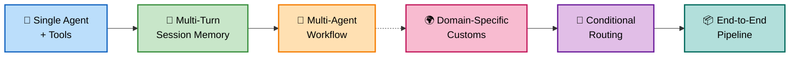
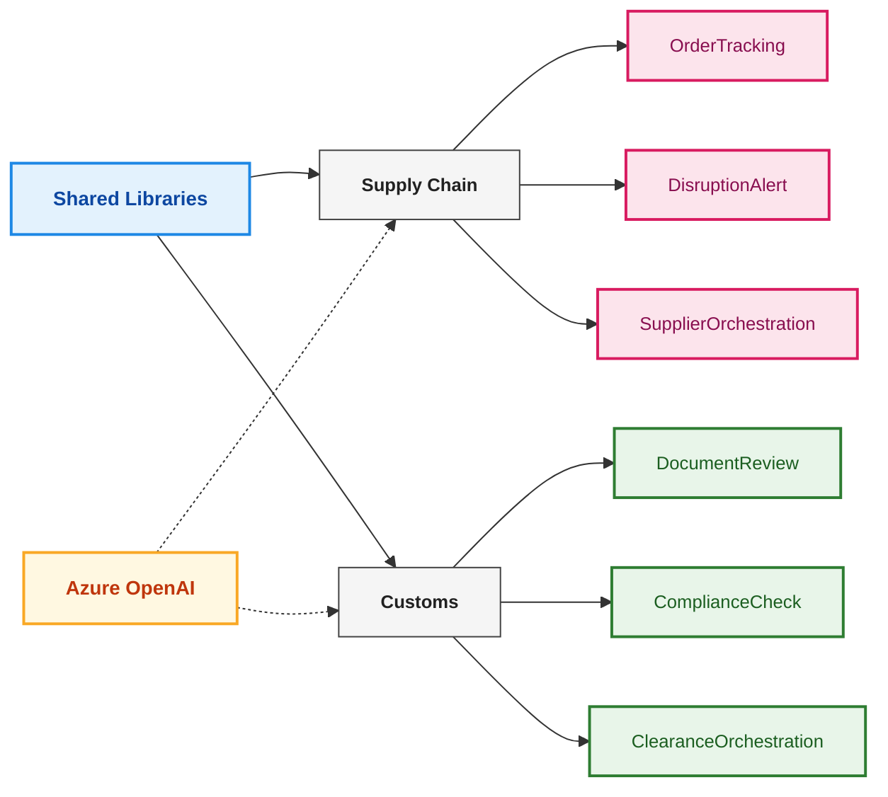
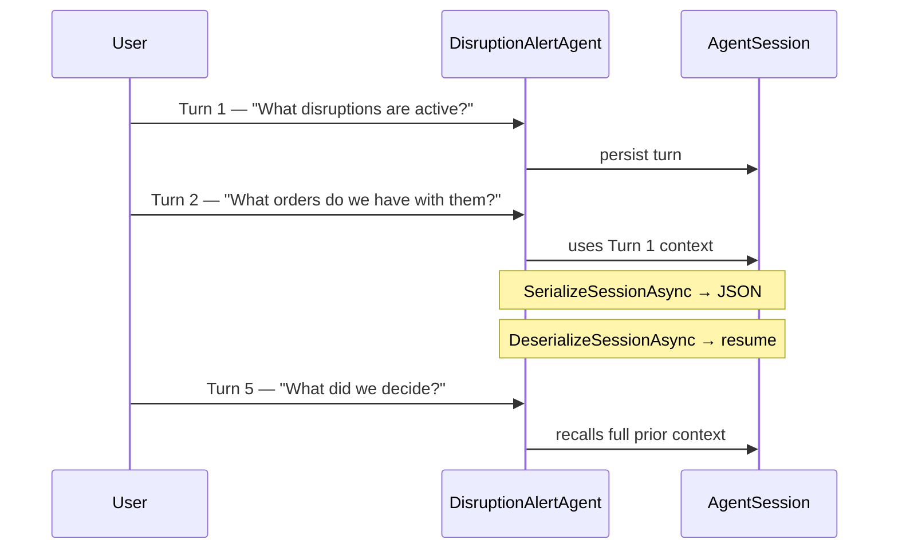
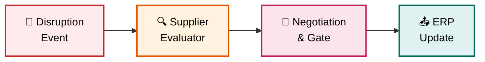
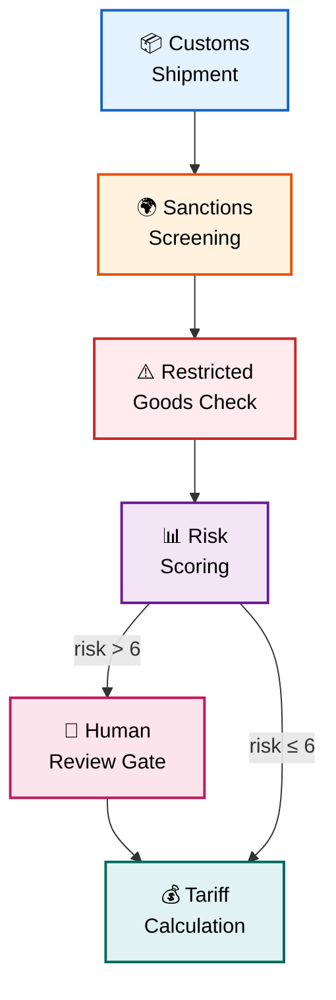

# Microsoft Agent Framework — Supply Chain & Customs Samples

A progressive showcase of the **Microsoft Agent Framework** (`Microsoft.Agents.AI` v1.1.0) in **.NET 10 / C# 13**, demonstrating the full spectrum from single-agent tool use to complex multi-agent orchestration workflows across two real-world domains: **Supply Chain** and **Customs Clearance**.

---

## Fundamentals (00) — Agent Framework Basics

**Progressive learning path** for developers new to the Microsoft Agent Framework. These examples build from basic concepts to advanced patterns, providing a solid foundation before exploring the domain-specific samples.

| Sample | Project | Concept | Key Feature |
| ------- | ------- | --------- | ------------ |
| 0a | `00-simple-agent` | 🤖 Basic Agent Creation | Single-turn interactions, no tools |
| 0b | `01-agent-with-tools` | 🔧 Agent + Tools | Function calling, tool registration |
| 0c | `02-anti-pattern-without-session` | ⚠️ Session Anti-Pattern | Why sessions are needed (educational) |
| 0d | `03-proper-session-multiturn` | 💾 Session-Based Multi-Turn | Context persistence, serialization |

---

## Framework Concepts — Progression Map




### Fundamentals 0a: Simple Agent (🤖 Basic Agent Creation)

**Pattern:** Basic agent creation and single-turn interactions

| Detail | Value |
| ------- | ------- |
| Project | `00-simple-agent` |
| Agent | `SimpleAgent` |
| Key API | `AsAIAgent()`, `RunAsync()` |
| Tools | None |

The most basic agent setup — create an agent with instructions and have a single conversation turn. Demonstrates the minimal code needed to get an agent responding to queries.

```csharp
var agent = azureOpenAI.GetChatClient(deployment)
    .AsAIAgent(instructions: "You are a helpful assistant.", name: "SimpleAgent");

var response = await agent.RunAsync("Hello, who are you?");
Console.WriteLine(response.Text);
```

---

### Fundamentals 0b: Agent with Tools (🔧 Agent + Tools)

**Pattern:** Agent with function calling capabilities

| Detail | Value |
| ------- | ------- |
| Project | `01-agent-with-tools` |
| Agent | `ToolAgent` |
| Key API | `AIFunctionFactory.Create()`, `AsAIAgent(tools: ...)` |
| Tools | `GetWeather`, `ConvertTemperature`, `GetPopulation` |

Shows how to register tools with an agent, enabling function calling. The agent can call these tools to get real-time data or perform calculations before responding.

```csharp
var tools = new[]
{
    AIFunctionFactory.Create(GetWeather),
    AIFunctionFactory.Create(ConvertTemperature),
    AIFunctionFactory.Create(GetPopulation)
};

var agent = azureOpenAI.GetChatClient(deployment)
    .AsAIAgent(instructions: "...", name: "ToolAgent", tools: tools);

var response = await agent.RunAsync("What's the weather in Tokyo and its population?");
Console.WriteLine(response.Text);
```

---

### Fundamentals 0c: Anti-Pattern Without Session (⚠️ Session Anti-Pattern)

**Pattern:** Demonstrates why sessions are needed (educational example)

| Detail | Value |
| ------- | ------- |
| Project | `02-anti-pattern-without-session` |
| Agent | `StatelessAgent` |
| Key API | Multiple `RunAsync()` calls without session |
| Tools | None |

**Educational example** showing what happens when you try multi-turn conversations without session memory. Each call to `RunAsync()` is completely independent, so the agent has no memory of previous turns.

```csharp
var agent = azureOpenAI.GetChatClient(deployment)
    .AsAIAgent(instructions: "...", name: "StatelessAgent");

// Turn 1
var response1 = await agent.RunAsync("My name is Alice");
Console.WriteLine(response1.Text); // Agent acknowledges

// Turn 2 — Agent has no memory of Turn 1!
var response2 = await agent.RunAsync("What's my name?");
Console.WriteLine(response2.Text); // Agent doesn't know!
```

---

### Fundamentals 0d: Proper Session Multi-Turn (💾 Session-Based Multi-Turn)

**Pattern:** Correct multi-turn conversations with session persistence

| Detail | Value |
| ------- | ------- |
| Project | `03-proper-session-multiturn` |
| Agent | `SessionAgent` |
| Key API | `CreateSessionAsync()`, `RunAsync(session)`, `SerializeSessionAsync()` |
| Tools | None |

Demonstrates proper multi-turn conversations using `AgentSession` for context persistence. The agent remembers information across turns and can be serialized/deserialized for persistence.

```csharp
var agent = azureOpenAI.GetChatClient(deployment)
    .AsAIAgent(instructions: "...", name: "SessionAgent");

var session = await agent.CreateSessionAsync();

// Turn 1
var response1 = await agent.RunAsync("My name is Alice", session);
Console.WriteLine(response1.Text);

// Turn 2 — Agent remembers!
var response2 = await agent.RunAsync("What's my name?", session);
Console.WriteLine(response2.Text); // Agent correctly says "Alice"

// Serialize session for persistence
var json = await agent.SerializeSessionAsync(session);
```

---


## Architecture Overview



---

## Samples

**Quick Reference — Which Concept Does Each Sample Demonstrate?**

| Sample | Project | Concept | Key Feature |
| ------- | ------- | --------- | ------------ |
| 1 | `SupplyChain.OrderTracking` | 🔧 Single Agent + Tools | Streaming API calls |
| 2 | `SupplyChain.DisruptionAlert` | 💾 Multi-Turn Session Memory | Context persistence across turns |
| 3 | `SupplyChain.SupplierOrchestration` | 🔀 Multi-Agent Workflow | Executor orchestration + human gate |
| 4 | `Customs.DocumentReview` | 🌍 Single Agent + Domain Tools | Structured review workflow |
| 5 | `Customs.ComplianceCheck` | 🛢️ Conditional Routing + Human Gate | Dynamic routing based on risk score |
| 6 | `Customs.ClearanceOrchestration` | 📦 End-to-End Pipeline | 6-stage pipeline with tracing |


## Solution Structure

```text
learning_agent_framework/
├── SupplyChainCustoms.AgentFramework.slnx
│
├── shared/
│   ├── SharedModels/
│   │   └── SharedModels/
│   │       ├── SupplyChain/
│   │       │   ├── Shipment.cs       — Shipment, ShipmentEvent, ShipmentStatus
│   │       │   ├── Supplier.cs       — Supplier, SupplierDisruption, DisruptionSeverity
│   │       │   └── Order.cs          — Order, OrderLine, OrderStatus
│   │       └── Customs/
│   │           ├── Shipment.cs       — CustomsShipment, CustomsLine
│   │           ├── TradeDocument.cs  — TradeDocument, DocumentField, DocumentType
│   │           └── ComplianceResult.cs — ComplianceResult, FlagSeverity
│   │
│   └── MockDataServices/
│       └── MockDataServices/
│           ├── SupplyChain/
│           │   ├── MockShipmentService.cs  — TRK-001…005 (1 delayed, 1 in-transit)
│           │   ├── MockSupplierService.cs  — SUP-001…005 (SUP-002 disrupted: factory fire)
│           │   └── MockOrderService.cs     — 4 open orders
│           └── Customs/
│               ├── MockCustomsShipmentService.cs  — CSH-3001…3004 (3004: sanctioned)
│               ├── MockDocumentService.cs          — docs with intentional missing fields
│               └── MockTariffService.cs            — HS codes, duty rates, sanctioned countries
│
└── samples/
    ├── 01-supply-chain/
    │   ├── SupplyChain.OrderTracking/
    │   ├── SupplyChain.DisruptionAlert/
    │   └── SupplyChain.SupplierOrchestration/
    │       ├── Program.cs    — workflow wiring
    │       └── Executors.cs  — 3 executor classes
    │
    └── 02-customs/
        ├── Customs.DocumentReview/
        ├── Customs.ComplianceCheck/
        │   ├── Program.cs    — workflow + conditional edges
        │   └── Executors.cs  — 5 executor classes
        └── Customs.ClearanceOrchestration/
            ├── Program.cs    — 6-stage linear pipeline
            └── Executors.cs  — 6 executor classes + ClearanceContext
```

---

### Sample 1: Order Tracking (🔧 Single Agent + Tools)

**Pattern:** Single agent with domain tools, streaming output

| Detail | Value |
| ------- | ------- |
| Project | `SupplyChain.OrderTracking` |
| Agent | `OrderTrackingAgent` |
| Key API | `agent.RunStreamingAsync(query)` |
| Tools | `GetShipmentStatus`, `GetDelayedShipments`, `GetOrdersBySupplier`, `FlagDelayedShipment` |

The agent answers supply chain queries by calling registered tools backed by `MockShipmentService` and `MockOrderService`. Responses stream token-by-token via `IAsyncEnumerable<AgentResponseUpdate>`.

```csharp
var agent = azureOpenAI.GetChatClient(deployment)
    .AsAIAgent(instructions: "...", name: "OrderTrackingAgent",
        tools: [AIFunctionFactory.Create(GetShipmentStatus), ...]);

await foreach (var update in agent.RunStreamingAsync(query))
    Console.Write(update.Text);
```

---

### Sample 2: Disruption Alert (💾 Multi-Turn Session Memory)

**Pattern:** Multi-turn conversation with session persistence and serialization

| Detail | Value |
| ------- | ------- |
| Project | `SupplyChain.DisruptionAlert` |
| Agent | `DisruptionAlertAgent` |
| Key API | `CreateSessionAsync`, `SerializeSessionAsync`, `DeserializeSessionAsync` |
| Tools | `GetActiveDisruptions`, `GetSupplierProfile`, `FindAlternativeSuppliers`, `GetAffectedOrders`, `GetInTransitShipments` |

Demonstrates **cross-turn memory**: the agent recalls which supplier was discussed in Turn 1 when answering Turn 3. Includes a session serialization round-trip that simulates saving to a database and resuming mid-conversation.



---

### Sample 3: Supplier Orchestration (🔀 Multi-Agent Workflow)

**Pattern:** Multi-agent workflow — three specialised executors with human approval gate

| Detail | Value |
| ------- | ------- |
| Project | `SupplyChain.SupplierOrchestration` |
| Trigger | `DisruptionEvent` (SUP-002 factory fire, $1,700 at risk, 5-day deadline) |
| Executors | `SupplierEvaluatorExecutor` → `NegotiationExecutor` → `ErpUpdateExecutor` |
| Human gate | Console prompt in `NegotiationExecutor` — approve/reject contract switch |
| Output | `YieldOutputAsync` → `run.OutgoingEvents.OfType<WorkflowOutputEvent>()` |



---

### Sample 4: Document Review (🌍 Single Agent + Domain Tools)

**Pattern:** Single agent with document-domain tools, GO/NO-GO recommendations

| Detail | Value |
| ------- | ------- |
| Project | `Customs.DocumentReview` |
| Agent | `DocumentReviewAgent` |
| Key API | `agent.RunStreamingAsync(query)` |
| Tools | `ListDocumentsForShipment`, `ReviewDocumentFields`, `ValidateHsCode`, `CheckDocumentCompleteness`, `GetShipmentDetails` |

The agent performs a structured 5-step review: document presence → field completeness → HS code validation → cross-document discrepancies → GO/NO-GO recommendation. Uses mock shipments CSH-3001 (complete) and CSH-3002 (gyroscopes, dual-use concern).

---

### Sample 5: Compliance Check (🛢️ Conditional Routing + Human Gate)

**Pattern:** Workflow with conditional edge routing and human officer review gate

| Detail | Value |
| ------- | ------- |
| Project | `Customs.ComplianceCheck` |
| Executors | `SanctionsScreeningExecutor` → `RestrictedGoodsExecutor` → `RiskScoringExecutor` → *(conditional)* → `TariffCalculationExecutor` |
| Routing | `risk > 6` routes through `HumanReviewExecutor`; `risk ≤ 6` skips directly to tariff calc |
| Test data | CSH-3001 (low risk, auto-cleared), CSH-3002 (medium), CSH-3004 (sanctioned, high risk) |



```csharp
// Conditional edge — explicit type parameter required for inference
.AddEdge<ComplianceContext>(bRiskScoring, bHumanReview,
    condition: msg => msg != null && msg.RequiresHumanReview)
.AddEdge<ComplianceContext>(bRiskScoring, bTariffCalc,
    condition: msg => msg != null && !msg.RequiresHumanReview)
```

---

### Sample 6: Clearance Orchestration (📦 End-to-End Pipeline)

**Pattern:** Six-executor end-to-end pipeline with timestamp tracing, shared `ClearanceContext`

| Detail | Value |
| ------- | ------- |
| Project | `Customs.ClearanceOrchestration` |
| Data flow | `CustomsShipment` → `ClearanceContext` → ... → final certificate |
| Executors | 6 in sequence (see diagram below) |
| Tracing | `Trace.Step(step, shipmentId)` prints `[HH:mm:ss.fff]` timestamps |
| Output | `StatusExecutor` emits formal clearance certificate via `YieldOutputAsync` |

```mermaid
graph LR
    IN["📦 Shipment<br/>Pending"]
    E1["📋 Document<br/>Collection"]
    E2["🏷️ HS Code<br/>Classification"]
    E3["🛡️ Compliance<br/>Screening"]
    E4["💰 Duty<br/>Calculation"]
    E5["📝 Filing<br/>Submission"]
    E6["✅ Final<br/>Status"]
    OUT["📜 Clearance<br/>Certificate"]

    IN --> E1 --> E2 --> E3 --> E4 --> E5 --> E6 --> OUT

    style IN fill:#4a90e2,stroke:#003d99,stroke-width:3px,color:#fff
    style E1 fill:#7b68ee,stroke:#4c2a85,stroke-width:2px,color:#fff
    style E2 fill:#f39c12,stroke:#c87f0a,stroke-width:2px,color:#fff
    style E3 fill:#e74c3c,stroke:#a93226,stroke-width:2px,color:#fff
    style E4 fill:#1abc9c,stroke:#117a65,stroke-width:2px,color:#fff
    style E5 fill:#27ae60,stroke:#1a5f39,stroke-width:2px,color:#fff
    style E6 fill:#9b59b6,stroke:#6c3483,stroke-width:2px,color:#fff
    style OUT fill:#2ecc71,stroke:#1e8449,stroke-width:3px,color:#fff
```



The `ClearanceContext` record accumulates state across all six executors:

```csharp
record ClearanceContext(
    CustomsShipment Shipment,
    bool DocumentsComplete, List<string>? MissingDocs,
    bool ClassificationPassed, List<string>? ClassificationIssues,
    bool CompliancePassed, int RiskScore, List<string>? ComplianceFlags,
    decimal TotalDuty, decimal TotalVat, List<string>? DutyBreakdown,
    bool Filed, string? DeclarationRef
);
```

---

## Key Framework Patterns

### Creating an Agent

```csharp
// From any ChatClient (Azure OpenAI, OpenAI, etc.)
var agent = new AzureOpenAIClient(new Uri(endpoint), new ApiKeyCredential(apiKey))
    .GetChatClient(deploymentName)
    .AsAIAgent(
        instructions: "You are a ...",
        name: "MyAgent",
        tools: [AIFunctionFactory.Create(MyTool)]
    );
```

### Tool Registration

```csharp
[Description("Retrieves the current status for a shipment.")]
ShipmentStatus GetStatus(
    [Description("The tracking number, e.g. TRK-001")] string trackingNumber)
{ ... }

// Register with the agent
AIFunctionFactory.Create(GetStatus)
```

### Streaming vs. Non-Streaming

```csharp
// Streaming — for user-facing output
await foreach (var update in agent.RunStreamingAsync(prompt, session))
    Console.Write(update.Text);

// Non-streaming — inside executor handlers
var response = await agent.RunAsync(prompt);
Console.WriteLine(response.Text);  // use .Text, not .ToString()
```

### Multi-Turn Sessions

```csharp
AgentSession session = await agent.CreateSessionAsync();

// Each turn automatically uses prior context
await foreach (var update in agent.RunStreamingAsync(turn1, session)) ...
await foreach (var update in agent.RunStreamingAsync(turn2, session)) ...

// Persist and restore
var json    = await agent.SerializeSessionAsync(session);
var resumed = await agent.DeserializeSessionAsync(json);
```

### Executor + Workflow Pattern

```csharp
// 1. Define executor (partial class required for source generator)
internal sealed partial class MyExecutor(AIAgent agent) : Executor("MyStep")
{
    [MessageHandler]
    private async ValueTask<OutputType> HandleAsync(InputType input, IWorkflowContext wf)
    {
        var response = await agent.RunAsync(prompt);
        await wf.YieldOutputAsync("result summary", CancellationToken.None);
        return new OutputType(...);
    }
}

// 2. Bind and wire
var bStep1 = step1.BindExecutor();   // → ExecutorBinding
var bStep2 = step2.BindExecutor();

var workflow = new WorkflowBuilder("MyWorkflow")
    .BindExecutor(bStep1)            // → WorkflowBuilder (fluent)
    .BindExecutor(bStep2)
    .AddEdge(bStep1, bStep2)
    .Build();

// 3. Run
var run = await InProcessExecution.Default.RunAsync(workflow, input);
foreach (var evt in run.OutgoingEvents.OfType<WorkflowOutputEvent>())
    Console.WriteLine(evt.Data);
```

### Conditional Edges

```csharp
// Explicit type parameter required — C# cannot infer T from pattern-matching lambdas
.AddEdge<MyContext>(bSource, bHighRiskTarget,
    condition: msg => msg != null && msg.RiskScore > 6)
.AddEdge<MyContext>(bSource, bLowRiskTarget,
    condition: msg => msg != null && msg.RiskScore <= 6)
```

---

## NuGet Packages

| Package | Version | Used for |
| ------- | ------- | ---------- |
| `Microsoft.Agents.AI` | 1.1.0 | `AIAgent`, `AgentSession`, `AIFunctionFactory` |
| `Microsoft.Agents.AI.OpenAI` | 1.1.0 | `AsAIAgent()` extension on `ChatClient` |
| `Microsoft.Agents.AI.Workflows` | 1.1.0 | `Executor`, `WorkflowBuilder`, `InProcessExecution`, `IWorkflowContext` |
| `Microsoft.Agents.AI.Workflows.Generators` | 1.1.0 | Source generator for `[MessageHandler]` — **required** in all workflow projects |
| `Azure.AI.OpenAI` | 2.1.0 | `AzureOpenAIClient` |
| `Microsoft.Extensions.Configuration.Json` | 10.0.0 | `appsettings.json` loading |

> **Important:** `Microsoft.Agents.AI.Workflows.Generators` must be referenced in every project that uses `[MessageHandler]`. Without it, the source generator does not run and `Executor` subclasses will fail to compile (`CS0534`).

---

## Prerequisites & Setup

### Requirements

- .NET 10 SDK
- Azure OpenAI resource with a deployed model (e.g. `gpt-4o`)

### Configuration

Each sample project needs an `appsettings.json`:

```json
{
  "AzureOpenAI": {
    "Endpoint": "https://<your-resource>.openai.azure.com/",
    "DeploymentName": "gpt-4o",
    "ApiKey": "<your-api-key>"
  }
}
```

Or set environment variables: `AzureOpenAI__Endpoint`, `AzureOpenAI__DeploymentName`, `AzureOpenAI__ApiKey`.

### Build

```bash
dotnet build SupplyChainCustoms.AgentFramework.slnx
```

### Run a Sample

```bash
# Sample 1 — single agent, streaming
dotnet run --project samples/01-supply-chain/SupplyChain.OrderTracking/SupplyChain.OrderTracking

# Sample 2 — multi-turn session
dotnet run --project samples/01-supply-chain/SupplyChain.DisruptionAlert/SupplyChain.DisruptionAlert

# Sample 3 — workflow (will prompt for human approval)
dotnet run --project samples/01-supply-chain/SupplyChain.SupplierOrchestration/SupplyChain.SupplierOrchestration

# Sample 4 — customs document review
dotnet run --project samples/02-customs/Customs.DocumentReview/Customs.DocumentReview

# Sample 5 — compliance check with conditional routing (may prompt for officer approval)
dotnet run --project samples/02-customs/Customs.ComplianceCheck/Customs.ComplianceCheck

# Sample 6 — full clearance orchestration pipeline
dotnet run --project samples/02-customs/Customs.ClearanceOrchestration/Customs.ClearanceOrchestration
```

---

## Mock Data Reference

### Supply Chain Shipments

| ID | Status | Route | Notes |
| ---- | -------- | ------- | ------- |
| TRK-001-2025 | InTransit | Shanghai → Rotterdam | Normal |
| TRK-002-2025 | Delayed | Shenzhen → Los Angeles | Weather delay |
| TRK-003-2025 | InTransit | Mumbai → Hamburg | On time |
| TRK-004-2025 | AtPort | Taipei → New York | Customs hold |
| TRK-005-2025 | Delivered | Seoul → Sydney | Complete |

### Supply Chain Suppliers

| ID | Name | Reliability | Notes |
| ---- | ------ | ------------ | ------- |
| SUP-001 | TechParts Asia | 88/100 | Active, Electronics |
| SUP-002 | GlobalTech Components | — | **DISRUPTED** — factory fire |
| SUP-003 | EuroComponents GmbH | 91/100 | Active, best alternative |
| SUP-004 | AmeriParts Inc | 78/100 | Active |
| SUP-005 | AsiaManufacturing Co | 82/100 | Active |

### Customs Shipments

| ID | Importer | Origin | Risk | Notes |
| ---- | ---------- | -------- | ------ | ------- |
| CSH-3001 | TechImport UK Ltd | CN | Low | Standard electronics — clean |
| CSH-3002 | Precision Instruments | DE | Medium | Gyroscopes — dual-use concern |
| CSH-3003 | Apparel Imports Ltd | IN | Low | Textiles — routine |
| CSH-3004 | Industrial Machinery Co | IR | High | **Sanctioned origin**, restricted goods |

### Sanctioned Countries (MockTariffService)

`IR` (Iran), `KP` (North Korea), `SY` (Syria), `CU` (Cuba)
