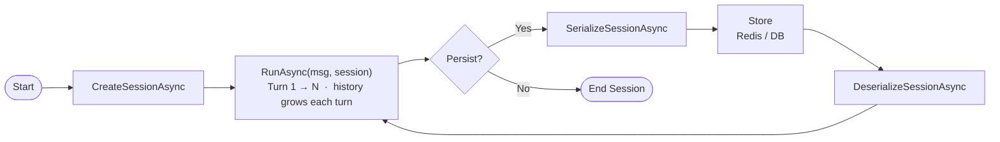

#  Fundamentals 04: Proper Multi-Turn with AgentSession

## Quick Context
This project demonstrates the **correct pattern for multi-turn conversations** using `AgentSession`. The agent maintains full conversation history, allowing it to remember context across multiple interactions and provide coherent, context-aware responses.

**Point to Remember:** Sessions are essential for stateful, context-aware agent interactions.

---

## Chat & Conversation Management

| Concept | Summary |
| --- | --- |
| **AgentSession** | Create once per conversation; pass to every `RunAsync()` / `RunStreamingAsync()` call |
| **Multi-turn** | Agent remembers previous inputs within the same session |
| **Persistence** | Serialize / deserialize session to DB, Redis, or file for cross-visit continuity |
| **Stateless Agent** | Agent holds no state — all memory lives in `AgentSession`; scales horizontally |
| **Token Management** | Full history is sent each turn; apply summarization or trimming for long sessions |
| **Lifecycle** | Create → reuse across turns → persist if needed → restore to continue |

## Key Benefits

- Maintains conversational context across turns
- Enables personalized and stateful interactions
- Supports long-running workflows
- Improves reliability and user experience
- Allows session recovery after restarts

---

## Key Methods Used

| API | Purpose |
|-----|---------|
| `agent.CreateSessionAsync()` | Create new session for conversation history |
| `agent.RunAsync(msg, session)` | Execute turn with session context |
| `agent.RunStreamingAsync(msg, session)` | Streaming with session state |
| `agent.SerializeSessionAsync(session)` | Persist session for storage |
| `agent.DeserializeSessionAsync(data)` | Restore session from storage |
| `response.WriteTokenUsageToConsole()` | Display token metrics |

---

## Session Flow



---

## Token Usage Tracking

Every `AgentResponse` exposes a `Usage` property with token counters, some examples are mentioned below:

| Field | Meaning |
| --- | --- |
| **InputTokenCount** | Tokens sent to the model (system prompt + full conversation history + new message) |
| **OutputTokenCount** | Tokens the model generated in its reply |
| **ReasoningTokenCount** | Internal chain-of-thought tokens (non-zero only on reasoning models) |
| **TotalTokenCount** | Input + Output + Reasoning combined |

`Usage` can be `null` if the model did not return usage data.

```csharp
var response = await agent.RunAsync("What is my name?", session);

Console.WriteLine(response.Usage?.InputTokenCount);   // grows each turn — full history resent
Console.WriteLine(response.Usage?.OutputTokenCount);
Console.WriteLine(response.Usage?.TotalTokenCount);
```

**Why it matters in multi-turn sessions:** `InputTokenCount` grows with every turn because the full conversation history is resent. Monitor it to decide when to apply summarization or trimming (see Pattern 3: Session with compaction).

---

## Code Snippets

### 1. Create a Session

```csharp
AIAgent agent = chatClient.AsAIAgent(
    instructions: "You are a helpful supply chain and customs assistant. Remember important operational details...",
    name: "ContextAwareAgent");
// Create a session - maintains conversation history
AgentSession session = await agent.CreateSessionAsync();
```
`AgentSession` holds conversation history and manages state across turns.

### 2. Execute Multi-Turn Interactions

```csharp
// Turn 1: User introduces themselves
AgentResponse response1 = await agent.RunAsync("My name is Alice. I lead customs operations through Rotterdam and Singapore.", 
                                               session);
// Turn 2: Agent remembers Alice - Agent will remember!
AgentResponse response2 = await agent.RunAsync("What is my name?", session); 
// Turn 3: Building on previous context
AgentResponse response3 = await agent.RunAsync("Our baseline clearance time is 30 hours; my goal is under 24 hours.", session);
// Turn 4: Agent recalls everything - Full context available!
AgentResponse response4 = await agent.RunAsync("Summarize what you know about my role, ports, and clearance target.", session);  
```

### 3. Streaming with Session State

```csharp
await agent.RunStreamingAsync(
    "Give me three practical weekly actions to improve document quality.",
    session)    
```

### 4. Session Persistence

```csharp
// Serialize session for database/cache storage
// In a real app: save serializedSession to Redis, SQL database, etc.
var serializedSession = await agent.SerializeSessionAsync(session);
// Later, restore the session
var restoredSession = await agent.DeserializeSessionAsync(serializedSession);
AgentResponse nextResponse = await agent.RunAsync("Continue our discussion...", restoredSession);
```

**Persist sessions to maintain conversations across app restarts.**

---

## Useful Patterns

### Pattern 1: Chat Loop
```csharp
AgentSession session = await agent.CreateSessionAsync();
while (true)
{
    string input = Console.ReadLine();
    var response = await agent.RunAsync(input, session);
    Console.WriteLine($"Agent: {response.Text}");
}
```

### Pattern 2: Session with Timeout
```csharp
var session = await agent.CreateSessionAsync();
var lastActivity = DateTime.UtcNow;

while ((DateTime.UtcNow - lastActivity).TotalMinutes < 30)
{
    var response = await agent.RunAsync(input, session);
    lastActivity = DateTime.UtcNow;
}
```

### Pattern 3: Session with compaction
```csharp
var session = await agent.CreateSessionAsync();
int turnCount = 0;

while (true)
{
    var response = await agent.RunAsync(input, session);
    turnCount++;

    // Compact session every 5 turns
    if (turnCount % 5 == 0)
    {
        // 1. Get current session data
        var data = await agent.SerializeSessionAsync(session);
        // 2. Summarize (you can call another LLM or utility)
        var summary = await SummarizeAsync(data);
        // 3. Create a new session with summary as starting context
        session = await agent.CreateSessionAsync();
        await agent.RunAsync($"Summary of previous conversation: {summary}", session);
    }
}
```