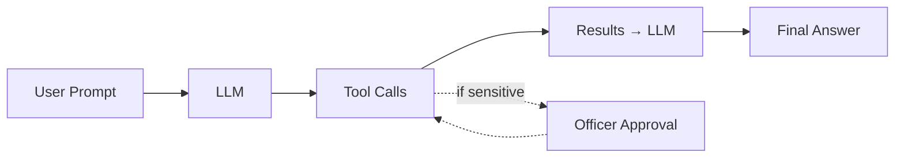

#  Fundamentals 07: Agent with Tools

[<- Back to Fundamentals Index](../README.md#code-flow-order)

## Quick Context
This project demonstrates how to extend agents with **function calling** capabilities. The agent can call tools to retrieve real-time data, perform calculations, or execute domain-specific logic before responding.

**Point to Remember:** Tools enable agents to access external data and services dynamically.

## Use Case: Customs Operations Assistant

This sample builds an AI agent that acts as a **customs clearance assistant**, helping port officers make decisions on incoming shipments.

### What the agent can do

**Shipment queries** (`ShipmentQueryTools`):

- Look up shipment status by ID — importer, origin country, declared value, and HS codes
- Look up tariff entries for HS codes — duty rate, VAT rate, and import licence requirement
- Check whether a country is on the sanctions list (Iran, North Korea, Syria, Cuba)
- List all shipments currently pending or under review
- Calculate estimated customs duty + VAT for a given HS code and declared value

**Port operations** (`PortOperationsTools`):

- Get disruption risk status for major ports (Singapore, Rotterdam, Los Angeles, Dubai)
- Estimate duty from a declared value and a duty rate percentage
- Get average customs clearance times per port

**Human-in-the-loop approval** (`ApprovalRequiredActions`):

- Flag a shipment for physical **detention** — a legally consequential action wrapped in `ApprovalRequiredAIFunction` that pauses execution and prompts the officer to confirm with `Y` before the order is recorded

### Key concepts demonstrated

| Concept | How it is shown |
| ------- | --------------- |
| Reflection-based tool registration | All public methods on the tool classes are auto-discovered and registered — adding a new method is enough to expose it to the agent |
| Human-in-the-loop / approval gate | The detention tool uses `ApprovalRequiredAIFunction`, surfacing a `ToolApprovalRequestContent` that the app must resolve before the agent continues |
| Tool-calling middleware | A pipeline middleware logs each tool call with timestamp, elapsed time, and whether calls ran sequentially or in **parallel** (highlighted in cyan) |


## Points to Consider

-  Register tools with an agent using `AIFunctionFactory`
-  Use reflection to expose public methods as tools
-  Enable agent function calling (tool invocation)
-  Combine tools from multiple classes
-  Handle tool responses and integrate them into answers

---

## Key Methods Used

| API | Purpose |
|-----|---------|
| `AIFunctionFactory.Create(method, instance)` | Wrap method as tool |
| `AiAgentFactory.CreateAgent(config, instructions, tools)` | Create agent with tools |

---

## Examples

### 1. Define Tool Methods

```csharp
public class PortOperationsTools
{
    [Description("Estimate customs duty amount from declared value and duty rate.")]
    public double EstimateCustomsDuty(
        [Description("Declared shipment value in USD")] double declaredValue,
        [Description("Duty rate as a percentage (for example, 8.5 for 8.5%)")] double dutyRatePercent)
    {
        return declaredValue * (dutyRatePercent / 100);
    }
}
```

Use `[Description]` attributes to explain what function does and also about the parameters for the agent.

### 2. Register Tools via Reflection

```csharp

PortOperationsTools simpleTools = new();
MethodInfo[] simpleMethods = typeof(PortOperationsTools).GetMethods(
    BindingFlags.Public | BindingFlags.Instance | BindingFlags.DeclaredOnly);

List<AITool> tools = methods
    .Select(m => AIFunctionFactory.Create(m, queryTools))
    .Concat(simpleMethods.Select(m => AIFunctionFactory.Create(m, simpleTools)))
    .Cast<AITool>()
    .ToList();
```

Reflection automatically discovers public methods and wraps them as tools.

### 3. Create Agent with Tools

```csharp
AIAgent agent = AiAgentFactory.CreateAgent(
        config,
        instructions: "You are a customs operations assistant with access to shipment data...",
        tools: tools)
    .AsBuilder()    
    .Build();
```

The agent now has access to all registered tools.

### 4.  Special Case: Approval Gate

Some operations require human approval:

```csharp
var detentionTool = AIFunctionFactory.Create(ApprovalRequiredActions.FlagShipmentForDetention);
tools.Add(new ApprovalRequiredAIFunction(detentionTool));
```
This wraps a tool to require user confirmation before execution.


---

## How Tool Calling Works



---

## Tools Called by Prompts (examples)

Here is a breakdown of which specific tools the AI Agent calls for the different suggested prompts:

> [!NOTE]
> A single prompt can trigger **multiple tool calls** — either in parallel or sequentially. When the LLM detects that a prompt contains multiple questions or requires data from different sources, it will invoke several tools in one turn to compose a complete answer (see the multi-part prompt example below).

| Prompt | Tool(s) Called | Reason |
|--------|----------------|--------|
| `What is the current disruption risk status at Rotterdam port?` | `GetPortRiskStatus` | The prompt asks for "disruption risk status" at a specific "port", matching the tool's description. |
| `Estimate duty for a shipment valued at 120000 USD with a duty rate of 7.5%. Include a short operational note.` | `EstimateCustomsDuty` | The user provides a declared value and a duty rate percentage to get an estimated duty amount. |
| `Which port has lower disruption risk: Singapore or Los Angeles? Also estimate duty on 50000 USD at 4%.` | `GetPortRiskStatus`, `EstimateCustomsDuty` | The agent executes parallel tool calls to answer multi-part questions, calling the disruption risk tool for each port, and the duty estimator tool for the numbers. |
| `What is the status of shipment CSH-3004?` | `GetShipmentStatus` | The prompt provides a specific Shipment ID (`CSH-3004`) and asks for its status. |
| `Look up the tariff for HS code 9014.20` | `LookupTariffEntry` | The user provides an HS code to retrieve the duty rate, VAT rate, and import license requirement. |
| `Is Iran sanctioned?` | `IsCountrySanctioned` | The user provides a country name/code to check against the `SanctionedCountries` list. |
| `Calculate duty on HS 8507.60 with declared value 10000` | `CalculateDutyAmount` | The prompt provides an HS code. This tool looks up the tariff rate internally and calculates duty + VAT. |
| `Flag shipment CSH-3004 for detention (triggers approval)` | `FlagShipmentForDetention` | Direct instruction to flag a specific shipment. This tool requires explicit confirmation `[OFFICER APPROVAL REQUIRED]`. |

---

## Tool Tips

### Do's 
- Use descriptive `[Description]` attributes
- Keep tool parameters simple (strings, numbers, dates)
- Handle errors gracefully within tools
- Return string results for debugging

### Don'ts 
- Don't return complex nested objects
- Don't make tools extremely slow (>5 seconds)
- Don't expose sensitive operations without approval gates
- Avoid tools with too many parameters (use domain models instead)
 