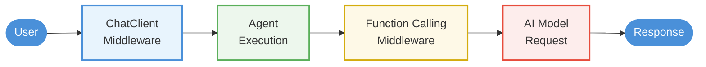

#  Fundamentals 07: Middleware Usage

[<- Back to Fundamentals Index](../README.md#code-flow-order)

## Quick Context
This project demonstrates how to intercept and modify agent behavior using **middleware**. Middleware lets you log operations, validate inputs, modify responses, enforce policies, and moreall without changing core agent logic.

**Point to Remember:** Middleware enables cross-cutting concerns like logging, security, and filtering.

---

## Key Methods Used

| API | Purpose |
|-----|---------|
| `chatClient.AsIChatClient().AsBuilder()` | Create middleware pipeline |
| `.Use(middleware)` | Add middleware layer |
| `.Build()` | Finalize pipeline |
| `Func<ChatMessage[], ChatOptions, Task<ChatResponse>>` | Middleware signature |
| `next(messages, options)` | Call next middleware layer |

---


## Points to Consider

-  Understand middleware pipeline architecture
-  Implement chat client middleware
-  Implement function calling middleware
-  Stack multiple middleware layers
-  Use middleware for logging and monitoring
-  Validate responses before returning to user

---

## Main Ideas

### Middleware Architecture



---

### 1. Chat Client Middleware

```csharp
// Middleware function that logs and monitors requests
async Task<ChatResponse> ChatClientMiddleware(
    ChatMessage[] messages,
    ChatOptions options,
    Func<ChatMessage[], ChatOptions, Task<ChatResponse>> next)
{
    // 1. Before: Log the request
    Console.WriteLine($"[Middleware] Request: {messages.Last().Content}");
    var stopwatch = Stopwatch.StartNew();
    
    // 2. Call the next layer in the pipeline
    var response = await next(messages, options);
    
    // 3. After: Log the response
    stopwatch.Stop();
    Console.WriteLine($"[Middleware] Response: {response.Message.Content}");
    Console.WriteLine($"[Middleware] Latency: {stopwatch.ElapsedMilliseconds}ms\n");
    
    return response;
}

// Apply middleware to agent
var agent = chatClient
    .AsIChatClient()
    .AsBuilder()
    .Use(getResponseFunc: ChatClientMiddleware, getStreamingResponseFunc: null)
    .BuildAIAgent(...);
```

---

### 2. Function Calling Middleware

```csharp
// Monitor and validate tool invocations
static ChatResponse ToolCallingMiddleware(
    ChatMessage[] messages,
    ChatOptions options,
    Func<ChatMessage[], ChatOptions, ChatResponse> next)
{
    var response = next(messages, options);
    
    // Inspect what tools the agent wants to call
    foreach (var content in response.Message.Content)
    {
        if (content is ToolCallContent toolCall)
        {
            Console.WriteLine($"[Tool Call] {toolCall.ToolName}");
            Console.WriteLine($"  Arguments: {toolCall.ToolCallArguments}");
            
            // Example: Block sensitive operations
            if (toolCall.ToolName == "FlagShipmentForDetention")
            {
                Console.WriteLine("    APPROVAL REQUIRED - Awaiting officer confirmation...");
                // Could prompt user, check approvals, etc.
            }
        }
    }
    
    return response;
}
```

---

### 3. Stacking Middleware

```csharp
var agent = chatClient
    .AsIChatClient()
    .AsBuilder()
    .Use(getResponseFunc: AuthenticationMiddleware)     // Layer 1
    .Use(getResponseFunc: LoggingMiddleware)           // Layer 2
    .Use(getResponseFunc: ValidationMiddleware)        // Layer 3
    .Use(getResponseFunc: ToolCallingMiddleware)       // Layer 4
    .BuildAIAgent(
        instructions: "You are a customs clearance assistant...",
        tools: customsTools);

// Request flow: Auth  Logging  Validation  ToolCalling  Agent
```

---

## Folder Layout

```
07-middleware-usage/
 Program.cs              # Main with 3 middleware demonstrations
 Middleware/
    ChatClientMiddleware.cs     # Log requests/responses
    ToolCallingMiddleware.cs    # Monitor tool invocations
    ValidationMiddleware.cs     # Validate inputs/outputs
 Tools/
    CustomsQueryTools.cs        # Customs domain tools
    ApprovalRequiredAIFunction.cs
 appsettings.json        # Azure OpenAI config
 07-middleware-usage.csproj
```

---

## In Practice

### Setup with Middleware

```csharp
var agent = chatClient
    .AsIChatClient()
    .AsBuilder()
    .Use(ChatClientMiddleware)
    .BuildAIAgent(
        instructions: "You are a customs clearance assistant with access to shipment data...",
        tools: [
            AIFunctionFactory.Create(CheckCompliance),
            AIFunctionFactory.Create(GetClearanceStatus),
            AIFunctionFactory.Create(ReviewDocuments)
        ]);
```

### Execution with Monitoring

```
User Input: "Flag shipment CSH-3004 for detention"
    
[Middleware] Request: Flag shipment CSH-3004 for detention
    
[Tool Call] CheckCompliance
  Arguments: {"origin": "Iran"}
    APPROVAL REQUIRED - Awaiting officer confirmation...
    
Agent generates response with tool results
    
[Middleware] Response: Shipment flagged successfully...
[Middleware] Latency: 1243ms
    
Response returned to user
```

---

## Where Middleware Helps

### 1. Logging & Monitoring
```csharp
async Task<ChatResponse> LoggingMiddleware(
    ChatMessage[] messages,
    ChatOptions options,
    Func<ChatMessage[], ChatOptions, Task<ChatResponse>> next)
{
    var timestamp = DateTime.UtcNow;
    var requestId = Guid.NewGuid();
    
    Console.WriteLine($"[{timestamp:O}] Request {requestId}: {messages.Last().Content}");
    var response = await next(messages, options);
    Console.WriteLine($"[{timestamp:O}] Response {requestId}: Success");
    
    return response;
}
```

### 2. Input Validation
```csharp
async Task<ChatResponse> ValidationMiddleware(
    ChatMessage[] messages,
    ChatOptions options,
    Func<ChatMessage[], ChatOptions, Task<ChatResponse>> next)
{
    // Check input size
    var inputSize = messages.Sum(m => m.Content?.Length ?? 0);
    if (inputSize > 10000)
        throw new InvalidOperationException("Input too large");
    
    // Check for prohibited content
    var lastMessage = messages.Last().Content;
    if (ContainsProhibitedContent(lastMessage))
        throw new InvalidOperationException("Prohibited content detected");
    
    return await next(messages, options);
}
```

### 3. Response Filtering
```csharp
async Task<ChatResponse> ResponseFilterMiddleware(
    ChatMessage[] messages,
    ChatOptions options,
    Func<ChatMessage[], ChatOptions, Task<ChatResponse>> next)
{
    var response = await next(messages, options);
    
    // Mask sensitive information in responses
    var content = response.Message.Content;
    if (content is TextContent textContent)
    {
        // Example: Remove specific patterns
        textContent.Text = MaskSensitiveData(textContent.Text);
    }
    
    return response;
}
```

### 4. Rate Limiting
```csharp
private int requestCount = 0;
private DateTime windowStart = DateTime.UtcNow;

async Task<ChatResponse> RateLimitMiddleware(
    ChatMessage[] messages,
    ChatOptions options,
    Func<ChatMessage[], ChatOptions, Task<ChatResponse>> next)
{
    requestCount++;
    
    // Reset window every 60 seconds
    if ((DateTime.UtcNow - windowStart).TotalSeconds > 60)
    {
        requestCount = 1;
        windowStart = DateTime.UtcNow;
    }
    
    if (requestCount > 100)  // Max 100 requests/minute
        throw new InvalidOperationException("Rate limit exceeded");
    
    return await next(messages, options);
}
```

---

## Middleware Stack Pattern

```csharp
public static class MiddlewareExtensions
{
    public static IChatClient WithSecurityMiddleware(this IChatClient client)
    {
        return client
            .AsBuilder()
            .Use(AuthenticationMiddleware)
            .Use(RateLimitMiddleware)
            .Use(InputValidationMiddleware)
            .Build();
    }
    
    public static IChatClient WithMonitoringMiddleware(this IChatClient client)
    {
        return client
            .AsBuilder()
            .Use(LoggingMiddleware)
            .Use(MetricsMiddleware)
            .Use(ErrorHandlingMiddleware)
            .Build();
    }
}

// Usage
var agent = chatClient
    .WithSecurityMiddleware()
    .WithMonitoringMiddleware()
    .AsAIAgent(...);
```

---

## Sample Output

```
=============================================================
  Customs Clearance Assistant with Middleware
=============================================================

[Tool:CheckCompliance] Entry: 14:23:45.123 | origin='Singapore'
[Tool:CheckCompliance] Exit:  14:23:45.245 | Result=Compliance check passed

Agent: Shipment from Singapore passes compliance check...

[Tool:GetClearanceStatus] Entry: 14:23:45.890 | shipmentId='CSH-3004'
[Tool:GetClearanceStatus] Exit:  14:23:46.012 | Result=Shipment is cleared

Agent: Shipment CSH-3004 is cleared for entry.
```

---

## Order Matters

```
Middleware Stack Order:

Layer 1 (Outermost):  Authentication     Runs first
Layer 2:              Rate Limiting     
Layer 3:              Logging           
Layer 4:              Validation        
Layer 5 (Innermost):  Tool Monitoring    Runs last

Request travels: 1  2  3  4  5  Agent  5  4  3  2  1
```

---

## Practical Tips

 **Do:**
- **Keep middleware thin:** Each middleware does one thing
- **Order logically:** Security  Monitoring  Validation  Domain
- **Handle errors:** Middleware should catch and handle exceptions
- **Log operations:** Help with debugging and auditing

 **Don't:**
- **Make middleware slow:** Avoid heavy processing
- **Modify requests unexpectedly:** Be transparent about changes
- **Nest middleware deeply:** Stack limits readability
- **Use for business logic:** Keep domain code separate

---

