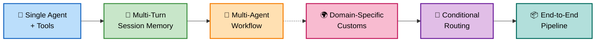

# Agent Framework Fundamentals (00)

Knowledge sharing examples for the **Microsoft Agent Framework** (`Microsoft.Agents.AI` v1.1.0) in **.NET 10 / C# 13**. These samples demonstrate foundational patterns — from the simplest single-turn agent to reasoning effort tuning — that underpin all domain-specific work in this repository.

---

## Samples

| Sample | Project | Concept | Key Feature |
| ------- | ------- | --------- | ------------ |
| 01 | `00-simple-agent` | 🤖 Basic Agent Creation | Single-turn interactions, no tools |
| 02 | `01-agent-with-tools` | 🔧 Agent + Tools | Function calling, tool registration |
| 03 | `02-anti-pattern-without-session` | ⚠️ Session Anti-Pattern | Why sessions are needed |
| 04 | `03-proper-session-multiturn` | 💾 Token Management in Sessions | Context persistence, token tracking per turn |
| 05 | `04-structured-output` | 📋 Structured Output | JSON schema output with customs assessment |
| 06 | `05-reasoning-effort` | 🧠 Reasoning Effort Controls | Baseline vs minimal vs high reasoning effort |
| 07 | `06-middleware-usage` | 🛡️ Middleware | Agent run, function calling, and chat client middleware in customs context |
| 08 | `07-agent-framework-skills` | 🧰📁 Combined Agent Skills | Programmatic + file-based Agent Skills in one customs workflow |
| 09 | `08-csharp-file-script-runner` | 🧾 C# File Script Runner | File-based `SKILL.md` scripts executed via C# `.csx` runner (no Python dependency) |

---

## NuGet Packages

| Package | Version | Used for |
| ------- | ------- | ---------- |
| `Microsoft.Agents.AI` | 1.1.0 | `AIAgent`, `AgentSession`, `AIFunctionFactory` |
| `Microsoft.Agents.AI.OpenAI` | 1.1.0 | `AsAIAgent()` extension on `ChatClient` |
| `Microsoft.Agents.AI.Workflows` | 1.1.0 | `Executor`, `WorkflowBuilder`, `InProcessExecution`, `IWorkflowContext` |
| `Microsoft.Agents.AI.Workflows.Generators` | 1.1.0 | Source generator for `[MessageHandler]` — **required** in all workflow projects |
| `Azure.AI.OpenAI` | 2.1.0 | `AzureOpenAIClient` |
| `Microsoft.Extensions.AI` | 10.4.0 | Shared chat abstractions and chat message types |
| `Microsoft.Extensions.Configuration.Json` | 9.0.4 | `appsettings.json` loading |

> **Important:** `Microsoft.Agents.AI.Workflows.Generators` must be referenced in every project that uses `[MessageHandler]`. Without it, the source generator does not run and `Executor` subclasses will fail to compile (`CS0534`).

---

## Framework Concepts — Overview Map



---

## Sample Details

### Fundamentals 01: Simple Agent (🤖 Basic Agent Creation)

**Pattern:** Basic agent creation and single-turn interactions

| Detail | Value |
| ------- | ------- |
| Project | `00-simple-agent` |
| Agent | `SimpleAgent` |
| Key API | `AsAIAgent()`, `RunAsync()` |
| Tools | None |

The most basic agent setup — create an agent with instructions and have a single conversation turn. Demonstrates the minimal code needed to get an agent responding to queries.

```csharp
var agent = azureOpenAI.GetChatClient(deployment)
    .AsAIAgent(instructions: "You are a helpful assistant.", name: "SimpleAgent");

var response = await agent.RunAsync("Hello, who are you?");
Console.WriteLine(response.Text);
```

---

### Fundamentals 02: Agent with Tools (🔧 Agent + Tools)

**Pattern:** Agent with function calling capabilities

| Detail | Value |
| ------- | ------- |
| Project | `01-agent-with-tools` |
| Agent | `ToolAgent` |
| Key API | `AIFunctionFactory.Create()`, `AsAIAgent(tools: ...)` |
| Tools | `GetWeather`, `ConvertTemperature`, `GetPopulation` |

Shows how to register tools with an agent, enabling function calling. The agent can call these tools to get real-time data or perform calculations before responding.

```csharp
var tools = new[]
{
    AIFunctionFactory.Create(GetWeather),
    AIFunctionFactory.Create(ConvertTemperature),
    AIFunctionFactory.Create(GetPopulation)
};

var agent = azureOpenAI.GetChatClient(deployment)
    .AsAIAgent(instructions: "...", name: "ToolAgent", tools: tools);

var response = await agent.RunAsync("What's the weather in Tokyo and its population?");
Console.WriteLine(response.Text);
```

---

### Fundamentals 03: Anti-Pattern Without Session (⚠️ Session Anti-Pattern)

**Pattern:** Demonstrates why sessions are needed and the consequences of stateless design

| Detail | Value |
| ------- | ------- |
| Project | `02-anti-pattern-without-session` |
| Agent | `StatelessAgent` |
| Key API | Multiple `RunAsync()` calls without session |
| Tools | None |

**Pattern demonstration** showing what happens when you try multi-turn conversations without session memory. Each call to `RunAsync()` is completely independent, so the agent has no memory of previous turns. This illustrates the importance of proper session management.

```csharp
var agent = azureOpenAI.GetChatClient(deployment)
    .AsAIAgent(instructions: "...", name: "StatelessAgent");

// Turn 1
var response1 = await agent.RunAsync("My name is Alice");
Console.WriteLine(response1.Text); // Agent acknowledges

// Turn 2 — Agent has no memory of Turn 1!
var response2 = await agent.RunAsync("What's my name?");
Console.WriteLine(response2.Text); // Agent doesn't know!
```

---

### Fundamentals 04: Proper Session Multi-Turn (💾 Token Management in Sessions)

**Pattern:** Correct multi-turn conversations with session persistence and token usage tracking

| Detail | Value |
| ------- | ------- |
| Project | `03-proper-session-multiturn` |
| Agent | `SessionAgent` |
| Key API | `CreateSessionAsync()`, `RunAsync(session)`, `SerializeSessionAsync()`, `TokenUsage` |
| Tools | None |

Demonstrates proper multi-turn conversations using `AgentSession` for context persistence with token usage tracking. The agent remembers information across turns, tracks cumulative token consumption (input/output/cache tokens), and can be serialized/deserialized for persistence. Each turn reports token metrics to understand API costs and quota management.

```csharp
var agent = azureOpenAI.GetChatClient(deployment)
    .AsAIAgent(instructions: "...", name: "SessionAgent");

var session = await agent.CreateSessionAsync();

// Turn 1
var response1 = await agent.RunAsync("My name is Alice", session);
Console.WriteLine(response1.Text);
Console.WriteLine($"Turn 1 — Input: {response1.InputTokenCount}, Output: {response1.OutputTokenCount}");

// Turn 2 — Agent remembers and tracks tokens!
var response2 = await agent.RunAsync("What's my name?", session);
Console.WriteLine(response2.Text); // Agent correctly says "Alice"
Console.WriteLine($"Turn 2 — Input: {response2.InputTokenCount}, Output: {response2.OutputTokenCount}");

// Serialize session for persistence
var json = await agent.SerializeSessionAsync(session);
```

---

### Fundamentals 05: Structured Output for Customs (📋 Structured Output)

**Pattern:** Structured JSON output via response schema, typed responses, and streaming assembly

| Detail | Value |
| ------- | ------- |
| Project | `04-structured-output-customs` |
| Agent | `CustomsStructuredOutputAgent` |
| Key API | `ChatResponseFormat.ForJsonSchema<T>()`, `RunAsync<T>()`, `RunStreamingAsync()` |
| Output Type | `CustomsClearanceAssessment` |

Shows how to constrain the model output to a strongly typed customs clearance schema. The sample demonstrates three patterns: response-format JSON text, generic typed output, and streaming output reassembly plus deserialization.

```csharp
var response = await agent.RunAsync<CustomsClearanceAssessment>(
    "Assess shipment CSH-3017 to Germany with HS code 854231 and duty rate 4.2%.");

Console.WriteLine(response.Result.RiskLevel);
Console.WriteLine(response.Result.EstimatedDutyUsd);
```

---

### Fundamentals 06: Reasoning Effort Controls (🧠 Reasoning Effort Controls)

**Pattern:** Reasoning effort configuration to optimize cost, latency, and quality trade-offs

| Detail | Value |
| ------- | ------- |
| Project | `05-reasoning-effort` |
| Agent | `ReasoningEffortAgent` |
| Key API | `ChatClientAgentOptions`, `MaxCompletionTokens`, Reasoning effort levels |
| Modes | `Baseline`, `Minimal`, `High` |

Demonstrates how to switch reasoning effort levels (when using reasoning models) to balance complexity, cost, and latency. Lower effort uses faster heuristics; higher effort uses extended thinking for complex problems. This sample shows three configurations on the same customs assessment task, comparing token usage and reasoning depth.

```csharp
// Baseline reasoning (default, balanced)
var baselineAgent = chatClient.AsAIAgent(instructions: "...", new ChatClientAgentOptions { });
var baselineResponse = await baselineAgent.RunAsync<CustomsAssessment>(prompt);
Console.WriteLine($"Baseline - Tokens: {baselineResponse.OutputTokenCount}");

// Minimal reasoning (faster, lower cost)
var minimalAgent = chatClient.AsAIAgent(instructions: "...", new ChatClientAgentOptions
{
    MaxCompletionTokens = 1000
});
var minimalResponse = await minimalAgent.RunAsync<CustomsAssessment>(prompt);
Console.WriteLine($"Minimal - Tokens: {minimalResponse.OutputTokenCount}");

// High reasoning (extended thinking, higher accuracy for complex decisions)
var highAgent = chatClient.AsAIAgent(instructions: "...", new ChatClientAgentOptions
{
    MaxCompletionTokens = 16000
});
var highResponse = await highAgent.RunAsync<CustomsAssessment>(prompt);
Console.WriteLine($"High - Tokens: {highResponse.OutputTokenCount}");

// Compare results
Console.WriteLine($"Baseline risk score: {baselineResponse.Result.RiskScore}");
Console.WriteLine($"High reasoning risk score: {highResponse.Result.RiskScore}");
```

---

### Fundamentals 07: Combined Agent Skills (🧰📁 Combined Agent Skills)

**Pattern:** Unified Microsoft Agent Framework skills sample combining programmatic and file-based skill styles

| Detail | Value |
| ------- | ------- |
| Project | `06-agent-framework-skills` |
| Agent | `CustomsSkillsAgent` |
| Key API | `AgentInlineSkill`, `AddResource`, `AddScript`, `AgentSkillsProvider`, `AIContextProviders`, file `SKILL.md` discovery |
| Inline Skills | `customs-clearance-packet`, `shipment-risk-triage` |
| File Skill | `customs-clearance-playbook` |
| Focus | Customs packet validation, duty estimation, risk lane recommendation, file-based playbook grounding |

Demonstrates both major Agent Skills authoring approaches in one place. The sample shows how to:
- Create skills directly in C# with `AgentInlineSkill`
- Add static and dynamic resources with `AddResource(...)`
- Add executable scripts with `AddScript(...)`
- Define a file-based skill using `skills/customs-clearance-playbook/SKILL.md` and markdown resources
- Register both skill sources with `AgentSkillsProvider`
- Attach both providers through `ChatClientAgentOptions.AIContextProviders`

This merged sample is the closest customs-domain equivalent to upstream Step02 + Step01 together. It also includes runtime tracing that prints `load_skill`, `read_skill_resource`, and script tool calls so you can confirm when skills are actually used.

```csharp
var inlineSkillsProvider = new AgentSkillsProvider(clearancePacketSkill, riskTriageSkill);
var fileSkillsProvider = new AgentSkillsProvider(Path.Combine(AppContext.BaseDirectory, "skills"));

var agent = azureClient
    .GetChatClient(deploymentName)
    .AsIChatClient()
    .AsAIAgent(new ChatClientAgentOptions
    {
        Name = "CustomsSkillsAgent",
        ChatOptions = new() { Instructions = "You are a customs clearance copilot." },
        AIContextProviders = [inlineSkillsProvider, fileSkillsProvider],
    });
```

**Sample use cases:**
- `> Using the customs-clearance-playbook skill, what documents must be present before filing customs entry?`
- `> What documents are required to clear an electronics shipment into the US?`
- `> Estimate duty for a shipment valued at 84,500 USD with a duty rate of 6.5%.`
- `> Assess a shipment from Vietnam with HS code 8542.31 and missing certificate of origin.`

---

## Key Framework Patterns

### Creating an Agent

```csharp
// From any ChatClient (Azure OpenAI, OpenAI, etc.)
var agent = new AzureOpenAIClient(new Uri(endpoint), new ApiKeyCredential(apiKey))
    .GetChatClient(deploymentName)
    .AsAIAgent(
        instructions: "You are a ...",
        name: "MyAgent",
        tools: [AIFunctionFactory.Create(MyTool)]
    );
```

### Tool Registration

```csharp
[Description("Retrieves the current status for a shipment.")]
ShipmentStatus GetStatus(
    [Description("The tracking number, e.g. TRK-001")] string trackingNumber)
{ ... }

// Register with the agent
AIFunctionFactory.Create(GetStatus)
```

### Streaming vs. Non-Streaming

```csharp
// Streaming — for user-facing output
await foreach (var update in agent.RunStreamingAsync(prompt, session))
    Console.Write(update.Text);

// Non-streaming — inside executor handlers
var response = await agent.RunAsync(prompt);
Console.WriteLine(response.Text);  // use .Text, not .ToString()
```

### Multi-Turn Sessions

```csharp
AgentSession session = await agent.CreateSessionAsync();

// Each turn automatically uses prior context
await foreach (var update in agent.RunStreamingAsync(turn1, session)) ...
await foreach (var update in agent.RunStreamingAsync(turn2, session)) ...

// Persist and restore
var json    = await agent.SerializeSessionAsync(session);
var resumed = await agent.DeserializeSessionAsync(json);
```

---

## Known Patterns & Troubleshooting

### ChatResponseFormat Disambiguation

When a project imports both `OpenAI.Chat` and `Microsoft.Extensions.AI`, the `ChatResponseFormat` type becomes ambiguous. **Always use the fully qualified type** to avoid compilation errors:

```csharp
// ❌ Ambiguous — will not compile
ResponseFormat = ChatResponseFormat.ForJsonSchema<MyOutputType>()

// ✅ Correct — use full namespace
ResponseFormat = Microsoft.Extensions.AI.ChatResponseFormat.ForJsonSchema<MyOutputType>()
```

### Reasoning Effort Configuration

In `Microsoft.Agents.AI.OpenAI v1.1.0`, custom `ChatOptions` for reasoning effort must be passed via `AsAIAgent(ChatClientAgentOptions)`. Named parameters like `options: ChatOptions(...)` are **not available**:

```csharp
// ❌ Will fail — no 'options:' parameter exists
var agent = chatClient.AsAIAgent(instructions: "...", options: new ChatOptions { ... });

// ✅ Correct — use ChatClientAgentOptions
var agent = chatClient.AsAIAgent(instructions: "...", new ChatClientAgentOptions
{
    ResponseFormat = Microsoft.Extensions.AI.ChatResponseFormat.ForJsonSchema<T>()
});
```

### Composing Multiple Tool Sets

**Create each tool sequence independently and concatenate**, rather than chaining `Select()` over existing `AIFunction` objects:

```csharp
// ❌ Will fail — type inference and delegate mismatch
var tools = toolSet1.Concat(AIFunctionFactory.Create(tool2Method)).Select(t => t);

// ✅ Correct — create each sequence separately
var toolsFromClass1 = new[] { AIFunctionFactory.Create(method1), ... };
var toolsFromClass2 = new[] { AIFunctionFactory.Create(method2), ... };
var allTools = toolsFromClass1.Concat(toolsFromClass2).ToArray();
```

---

## Prerequisites & Setup

### Requirements

- .NET 10 SDK
- Azure OpenAI resource with a deployed model (e.g. `gpt-4o`)

### Configuration

Each sample reads `appsettings.json` (linked from `shared/appsettings/appsettings.json`):

```json
{
  "AzureOpenAI": {
    "Endpoint": "https://<your-resource>.openai.azure.com/",
    "DeploymentName": "gpt-4o",
    "ApiKey": "<your-api-key>"
  }
}
```

### Run

```bash
# 01 — simple agent
dotnet run --project samples/00-fundamentals/00-simple-agent/00-simple-agent

# 02 — agent with tools
dotnet run --project samples/00-fundamentals/01-agent-with-tools/01-agent-with-tools

# 03 — anti-pattern (no session)
dotnet run --project samples/00-fundamentals/02-anti-pattern-without-session/02-anti-pattern-without-session

# 04 — proper session + token tracking
dotnet run --project samples/00-fundamentals/03-proper-session-multiturn/03-proper-session-multiturn

# 05 — structured output
dotnet run --project samples/00-fundamentals/04-structured-output/04-structured-output-customs

# 06 — reasoning effort controls
dotnet run --project samples/00-fundamentals/05-reasoning-effort/05-reasoning-effort

# 07 — combined Agent Skills APIs (inline + file-based)
dotnet run --project samples/00-fundamentals/06-agent-framework-skills/06-agent-framework-skills
```
